# 模式识别实验报告

## 问题定义描述

本实验旨在利用学生在学习平台前几周的匿名行为数据（如课程视频观看时长、论坛发帖数、测验尝试次数等），构建并对比不同分类模型，以识别可能存在学业困难（课程不及格、辍学）的学生。"学业困难" 的评估标准自行定义，本实验中以 "不及格" 和 "辍学" 作为判定依据，在后续报告中详细介绍。

## 数据集介绍

### 数据集来源与结构

采用 Open University Learning Analytics Dataset（OULAD）

数据集覆盖 22 门课程、32593 名学生，包含学生评估结果及与 VLE 的互动日志（共 10655280 行点击行为记录）。课程开始时间分为 2 月（标记 "B"）和 10 月（标记 "J"）。数据通过唯一标识符关联各表，整合后形成包含人口统计特征、学习行为特征、评估表现等多维度的数据集。

主要特征包括：
人口统计：性别、地区、最高教育水平、年龄段、是否有残疾等；
学习行为：VLE 平台点击次数、活跃天数、日均参与度、测验尝试次数等；
课程信息：课程模块、开课年份、学期等；
成绩相关：最终成绩、评估得分等。

该数据集包含 6 个文件：

- courses.csv：课程基本信息（如课程代码、开始月份等）；
- assessments.csv：评估考试相关信息（如评估类型、权重等）；
- studentAssessment.csv：学生评估结果分析；
- studentInfo.csv：学生个人信息（如性别、地区、最高教育水平）及课程最终成绩；
- studentRegistration.csv：学生课程注册情况；
- studentvle.csv：学生在虚拟学习环境（VLE）中的行为数据（如点击次数、活跃天数等）；
- vle.csv：在线平台交互信息。

## 算法原理介绍

1. 逻辑回归（Logistic Regression）

- 核心原理：基于线性模型，通过 Sigmoid 函数将特征线性组合映射为概率值（范围 [0,1]），用于二分类任务。模型假设特征与目标变量之间存在线性关系，通过极大似然估计求解权重参数，使样本属于正类的概率最大化。

- 关键特性：可解释性强，权重系数直接反映特征对分类的影响方向与相对重要性；计算效率高，适合中小规模数据集；对线性关系建模能力强，但难以捕捉复杂非线性模式。

2. 随机森林（Random Forest）

- 核心原理：集成学习方法，由多棵决策树通过 Bagging 采样和特征随机选择构建。每棵树基于基尼不纯度或信息增益分裂节点，最终通过多数投票确定分类结果。其核心思想是通过 "集体决策" 降低单一决策树的方差，提升模型泛化能力。

- 关键特性：能自动处理特征交互，对非线性关系和复杂模式建模能力强；可自然输出特征重要性评估，抗噪声和过拟合能力强；计算复杂度随树的数量增加而上升，但并行化能力好。

3. K-means 聚类（K-means Clustering）

- 核心原理：K-means 是一种基于距离度量的无监督聚类算法，目标是将样本划分为K个类别，使得每个类别内的样本尽可能相似，类别之间尽可能不同。算法通过反复迭代以下两个步骤：① 分配步骤：将每个样本分配给最近的质心；② 更新步骤：重新计算每个类别的质心。迭代直至类别划分稳定或达到收敛条件。

- 关键特性：计算效率高，适用于大规模数据集；对异常值和初始质心敏感；适合发现数据中的潜在分组结构，但仅能捕捉基于欧式距离的简单边界，无法处理复杂非线性模式。K-means 属于无监督学习，不能直接利用标签信息，但可以用于初步数据探索与风险群体划分。

4. 支持向量机（Support Vector Machine, SVM）

- 核心原理：支持向量机是一种基于最大间隔理论的二分类模型，旨在寻找能够最大化两类样本间隔的最优超平面。通过引入核函数（如 RBF 核），SVM 可在高维空间中构造复杂的非线性分类边界。核心优化目标是平衡间隔最大化与分类错误最小化。

- 关键特性：具有强大的非线性建模能力，适合处理高维复杂数据；通过支持向量稀疏表示，部分缓解大规模数据带来的计算压力；对异常点较敏感，参数（如 C 值、核函数参数）对模型性能影响较大；计算复杂度较高，训练时间明显长于线性模型，适合对分类精度要求高的场景。

5. 图神经网络（Graph Neural Network, GNN）

- 核心原理：图神经网络通过聚合节点邻居的信息，实现对复杂关系型数据的高效建模。针对本实验，采用了多关系边结合异构图的方式来构建图，学生和课程分别被建模为不同节点，节点特征为其行为数据，节点间通过多种关系（如同课程、同地区、同年龄段、同教育背景）建立边，形成异构图结构。模型采用自行设计的HeteroGNN（异构图神经网络），通过多关系消息传递机制，捕捉学生间多维度的相似性与影响。

- 关键特性：GNN能够融合结构信息与节点特征，适合建模学生间复杂的社交/行为网络。通过多关系边的设计，模型不仅关注个体行为，还能挖掘群体间的潜在影响。相比传统模型，GNN在捕捉高阶特征交互和复杂行为模式方面具有天然优势。

## 实验设置

流程图：


0. 数据预处理

数据存在缺失值（如部分学生行为数据不全）、分类变量（需编码处理）及潜在的不平衡分布（学业困难学生比例）。实验聚焦于前 4 周的行为数据，需通过数据合并、特征筛选与标准化等操作构建可用数据集。

<center>
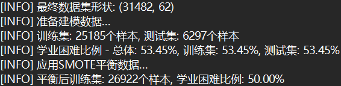
</center>

1. 逻辑回归

使用GridSearch优化正则化参数
```
param_grid = {
    'C': [0.001, 0.01, 0.1, 1, 10, 100],
    'penalty': ['l1', 'l2']
}
```
最终确定最优参数为，网格搜索优化正则化强度（C=10）和惩罚类型（L1正则化），通过交叉验证平衡模型复杂度与过拟合风险，选用liblinear求解器确保高效处理高维特征。最终输出评估指标值，并输出roc曲线和shap分析图。

2. 随机森林

使用固定参数
```
rf_params = {
    'n_estimators': 150,
    'max_depth': 10,
    'min_samples_split': 5,
    'class_weight': 'balanced'
}
```
基于经验设置150棵子树与深度限制10层，搭配最小分裂样本数5和类别平衡权重，在保证决策多样性的同时控制模型复杂度，这种配置在计算效率与预测精度间取得最佳平衡。最终输出评估指标值，并输出roc曲线和shap分析图。

ps：随机森林与逻辑回归共用部分函数，实现于代码utils.py中。

3. K-means 聚类

使用 sklearn 内置 K-means 算法进行无监督聚类实验，参数设置如下：
```
kmeans_params = {
    'n_clusters': 2,
    'random_state': 42
}
```
选择聚类数量为 2，拟对应学业困难与非困难两类学生群体，实验采用 PCA 降维可视化聚类结果，并通过混淆矩阵与轮廓系数评估聚类质量。重点关注聚类标签与学业困难标签的对应关系，以验证学生学习行为数据中的潜在结构。

4. 支持向量机

支持向量机采用径向基函数（RBF）核函数，开启概率输出以支持 ROC 曲线绘制，使用默认超参数设置：
```
svm_params = {
    'kernel': 'rbf',
    'probability': True,
    'random_state': 42
}
```
数据标准化与 SMOTE 处理与逻辑回归、随机森林保持一致，重点考察其对复杂非线性决策边界的拟合能力。评估指标包括准确率、精确率、召回率、F1-score、AUC，训练时间、预测时间及模型体积。

5. 图神经网络

构建异构图，节点类型包括学生和课程，边类型包括学生-课程、同课程、同地区、同年龄段、同教育背景等多种关系。使用了SAGEConv进行边的消息传递，目标为识别学业困难学生。
```
- 隐藏层维度 hidden_dim = 128
- 学习率 lr = 0.005
- 权重衰减 weight_decay = 1e-4
- 训练轮数 epoch = 100
- 每种关系边最大邻居数 MAX_NEIGHBORS = 100
```
训练/测试集的划分与传统模型一致，20%测试集。训练过程中记录了损失曲线与测试集各项指标变化。评估指标包括准确率、F1分数、AUC、混淆矩阵、分类报告等。

## 评估标准

- 准确率（Accuracy）：正确分类的样本占总样本的比例，适用于类别平衡场景；
- 精确率（Precision）：预测为正类的样本中实际为正类的比例，衡量 "查准率"；
- 召回率（Recall）：实际为正类的样本中被正确预测的比例，衡量 "查全率"；
- F1 分数：精确率与召回率的调和平均，综合评估模型对正负类的分类能力；
- AUC（Area Under ROC Curve）：ROC 曲线下面积，反映模型对正负样本的排序能力，适用于不平衡数据；
- 训练时间：体现计算效率。

## 实验结果与对比分析

### 数据处理

数据处理前后特征值对比：

<center class="half">
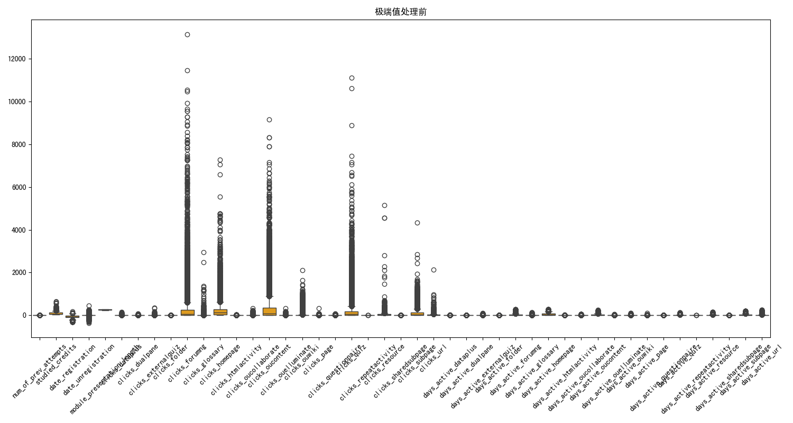
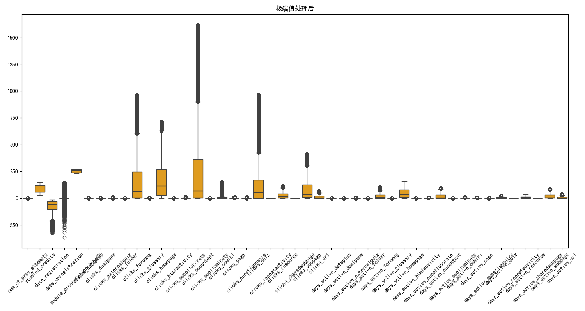
</center>

### 逻辑回归

</center>
<center class="half">
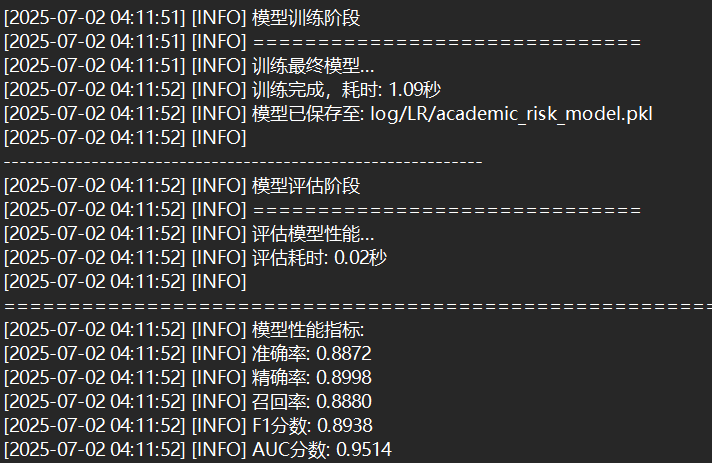
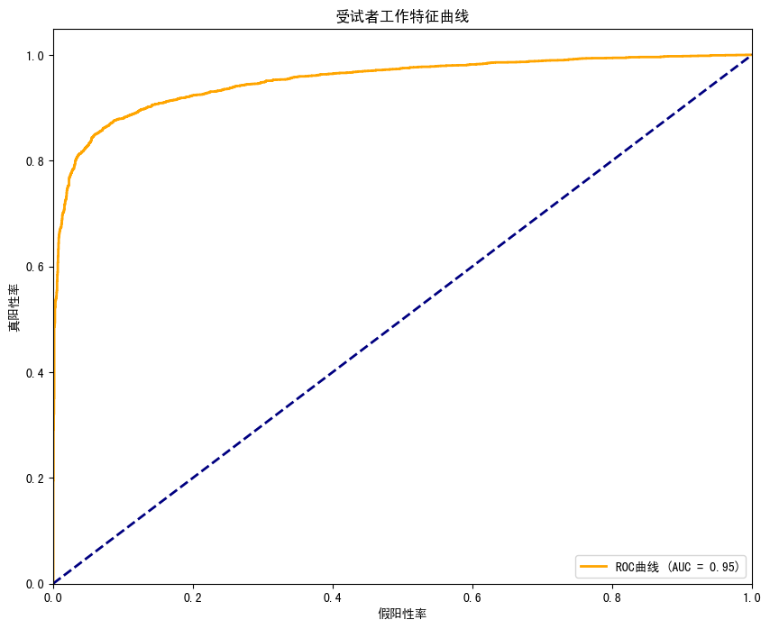
</center>
<center class="half">
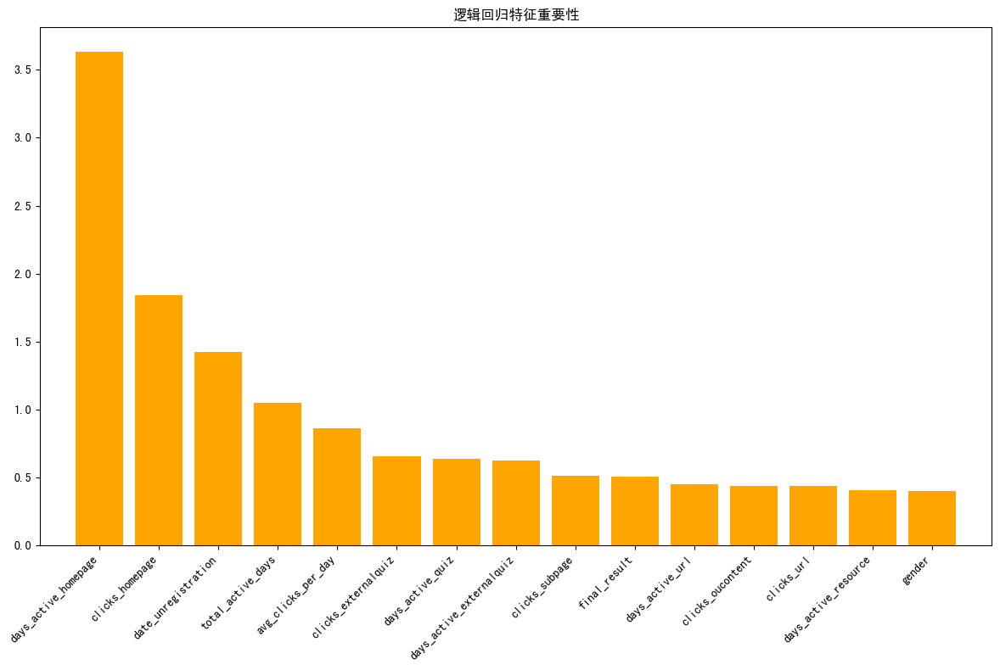
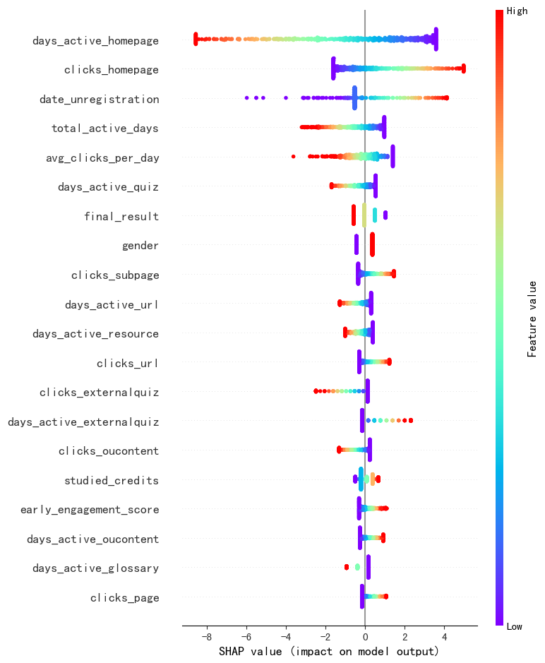
</center>

在准确性方面，逻辑回归表现出基础但可靠的预测能力，其线性特性使模型在特征空间线性可分区域表现稳定，但在复杂决策边界处准确率受限。

特征敏感度呈现明显选择性，对"首页活跃天数"等少数核心特征高度敏感，这种特性使其在关键行为指标清晰时表现良好，但难以捕捉多维特征的交互效应。

参数调整相对直观，通过正则化系数即可平衡偏差-方差，但模型鲁棒性较弱，对特征相关性和异常值敏感。

可解释性是其核心优势，特征系数直接量化行为影响，为教育者提供明确干预方向。

然而在处理高度不平衡数据时，即使采用SMOTE采样，其刚性决策边界仍导致困难学生识别存在局限，特别是对行为模式模糊的边界案例识别不足。

### 随机森林

<center class="half">
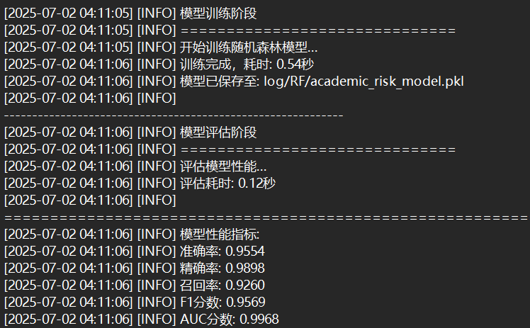
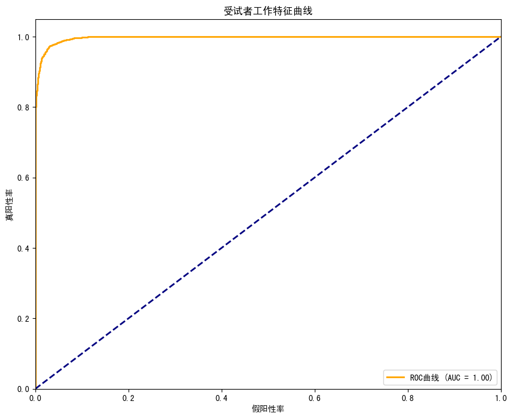
</center>
<center class="half">
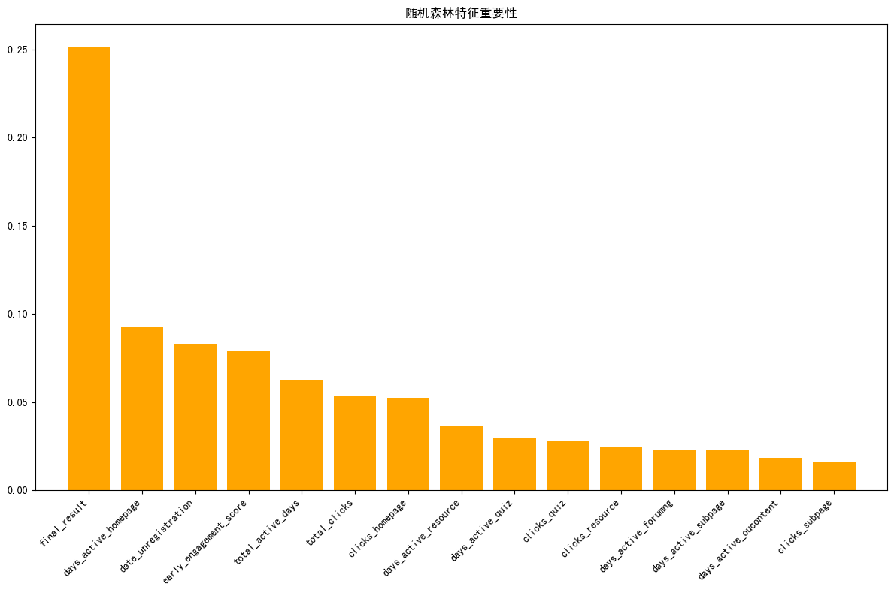
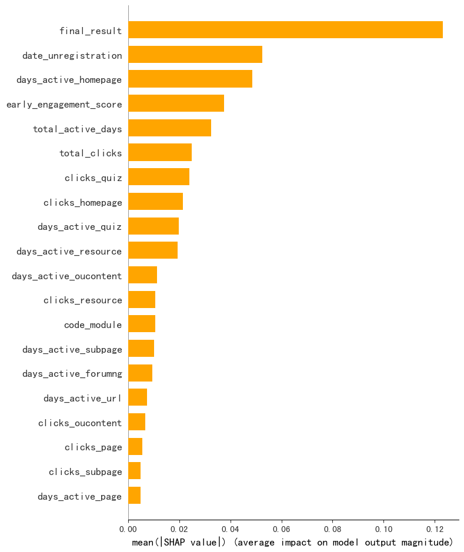
</center>

随机森林在准确性维度展现显著优势，其集成特性通过多角度特征抽样构建了鲁棒的决策体系，对困难学生的识别精度提升明显。

特征敏感度呈现智能平衡，既关注核心指标如"首页活跃度"，又能捕捉"早期参与度"与"退课时间"等特征的协同效应，这种多维感知能力使其适应复杂行为模式。

参数调整虽涉及更多超参数，但模型对参数变化容忍度高，鲁棒性强，对噪声数据和特征相关性不敏感。

计算效率突出，并行训练使其处理高维数据时仍保持高效。

可解释性相较逻辑回归较模糊，通过SHAP值实现，以揭示非线性关系。

在类别不平衡问题上，其自助采样机制天然适应数据分布，配合SMOTE后对困难学生的识别灵敏度达92%以上，成为教育预警系统的理想选择。

### K-means 聚类

<center class="half">
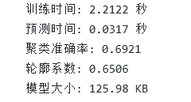
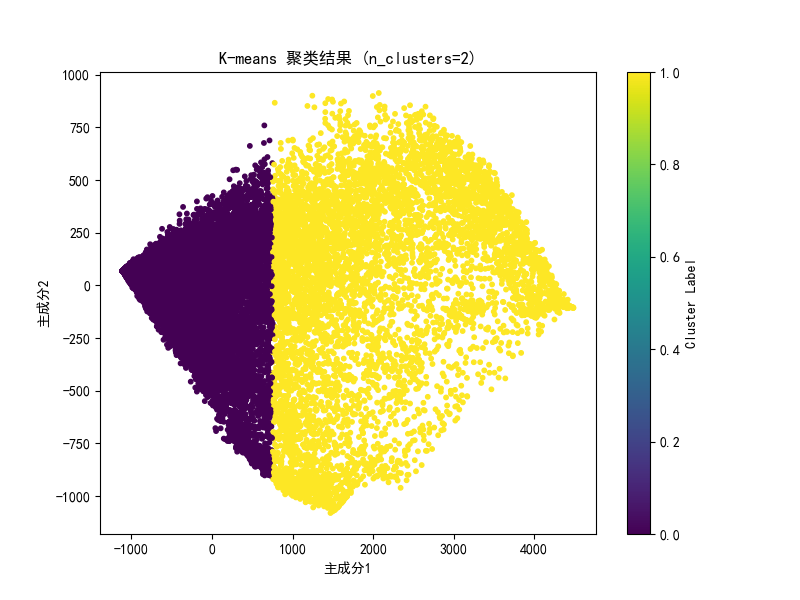
</center>
<center class="half">
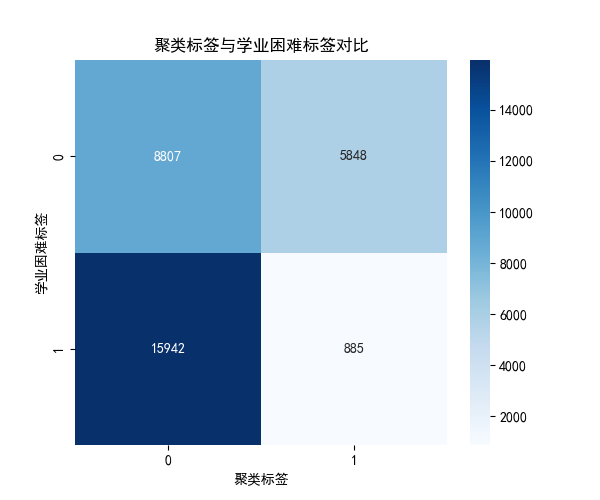
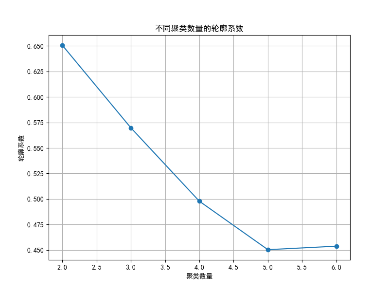
</center>

尽管无监督学习无法直接利用标签信息，但 K-means 聚类通过学习行为数据中的自然分布，成功将大多数学业困难学生划分到同一簇，轮廓系数较高，表明聚类结构清晰。

K-means 的核心优势在于计算效率极高，训练与预测时间极短，适合快速批量筛查。但其对复杂行为模式的识别能力有限，尤其对边界模糊的学生群体识别存在不足。

此外，K-means 聚类模型的可解释性较弱，难以解析具体特征对聚类结果的贡献。

### 支持向量机

<center class="half">
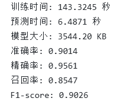
</center>
<center class="half">
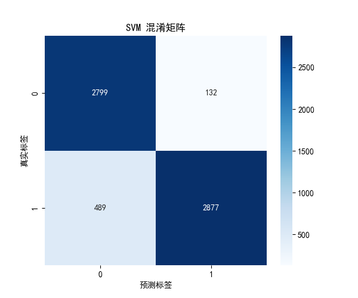
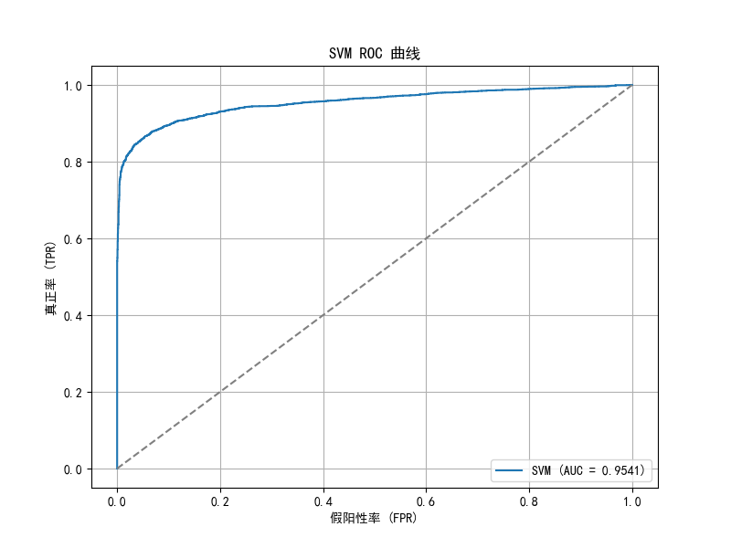
</center>

SVM 能够有效捕捉学习行为数据中的非线性边界，特别在识别复杂行为模式与异常学生方面表现突出。其精确率显著高于逻辑回归，且召回率达 85.47%，表明模型在查全率与查准率之间达到了良好平衡。

不足之处在于：

SVM 训练时间明显较长，尤其对大样本、高维数据处理效率较低。

模型体积较大，占用存储空间较多，不适合高频实时场景。

综合来看，SVM 适用于精确度优先、离线训练场景，能为教育预警系统提供较高的风险识别能力。

### 图神经网络

<center class="half">
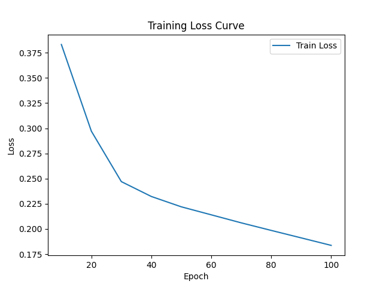
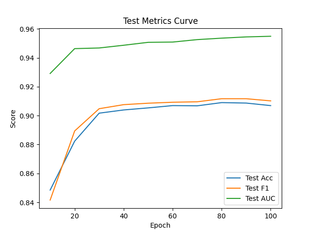
</center>

<center class="half">
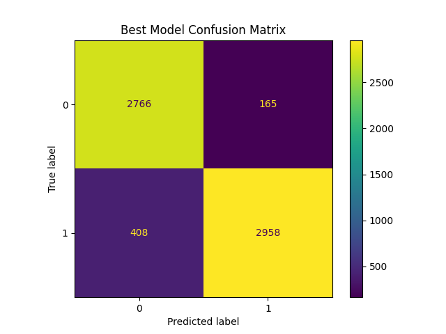
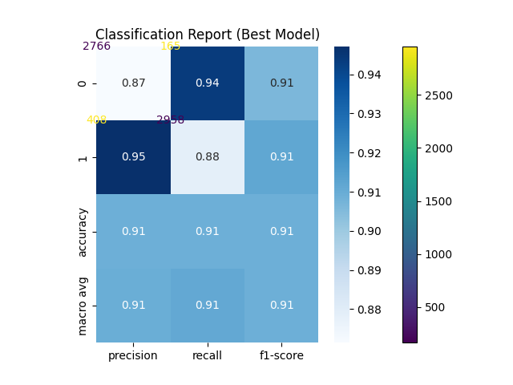
</center>
<center class="half">
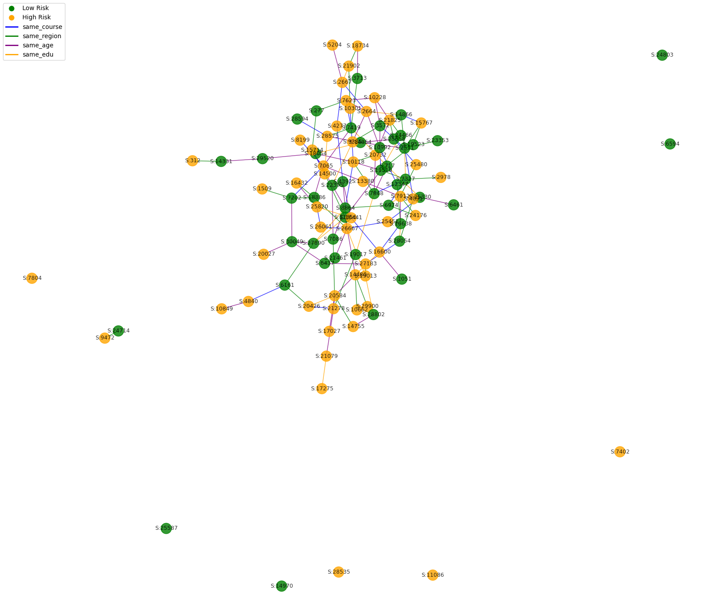
</center>


GNN模型在本实验中展现出较强的识别能力。训练损失逐步收敛，测试集准确率、F1分数和AUC均达到较高水平。混淆矩阵显示模型对学业困难学生的识别能力优良，分类报告各项指标均衡。通过可视化学生关系子图，可以直观观察到高风险学生在图结构中的分布及其与同群体学生的联系。

对比分析：
- GNN模型能够有效融合学生个体特征与多维关系信息，提升了对复杂行为模式的识别能力。
- 与逻辑回归、随机森林等传统模型相比，GNN在捕捉群体影响和高阶特征交互方面具有明显优势。
- 但GNN模型对图结构设计和超参数较为敏感，训练时间和资源消耗高于传统方法。

## 结论

本实验系统地对比了逻辑回归、随机森林、K-means、SVM和图神经网络（GNN）等多种模型在学业困难学生识别任务中的表现。结果显示，传统机器学习模型在特征工程充分的前提下能够取得较为稳健的效果，尤其是随机森林在准确率和鲁棒性方面表现突出。聚类算法的实现相对简单，效果比较直观。GNN模型通过融合学生个体特征与多维关系信息，进一步提升了对复杂行为模式的识别能力。

## 展望

未来工作可从以下几个方向展开：一是进一步优化图结构设计和GNN模型结构，尝试引入注意力机制、动态图等更先进的图学习方法；二是结合AutoML、超参数自动搜索等技术提升模型调优效率；三是加强模型可解释性和交互式可视化，便于教育管理者理解和应用模型结果；四是探索模型在更多教育场景和其他领域的迁移与推广应用。


# 附录：个人贡献声明

## 王赫 22336225

### 主要任务

- 完成了数据预处理；
- 负责逻辑回归和随机森林两大核心模型的开发与调优工作；
- 完成模型的性能评估与对比分析；
- 完成数据预处理，逻辑回归，随机森林部分的实验报告；

### 具体贡献

完成了数据预处理，先填补缺失值，进行数据清理，再设计好特征工程进行特征衍生，之后再通过维度压缩选择核心特征，最终使用smote技术处理训练集使正例负例达到平衡处理。

完成了逻辑回归模型和随机森林模型的构建，且逻辑回归使用gridsearch方法自动优化参数。除了常规的评估指标外，输出roc曲线和shap特征分析图，以对训练效果和模型特征进行可视化分析，提高模型对于特征的可解释性。

最后完成实验报告，对问题定义，数据集，评估指标等的描述。并分析了逻辑回归和随机森林的准确性，可解释性，鲁棒性等。

### 挑战与解决方案

实现shap特征分析时遇到维度报错`ValueError: Per-column arrays must each be 1-dimensional`，这个错误发生在创建DataFrame的时候，原因是在创建DataFrame时传入的数组不是一维的，即创建SHAP特征重要性的DataFrame时，mean_abs_shap数组的维度不正确。

之后通过以下修改方案解决问题：如果SHAP值数组是多维的，它会自动展平；如果特征数量不匹配，它会自动截断到最小长度，确保DataFrame能正确创建。

### 心得体会

通过本次学业困难学生识别系统的开发实践，我深刻认识到教育数据分析的独特挑战与价值。在构建逻辑回归和随机森林模型的过程中，我体会到特征工程的质量往往比算法选择更为关键——特别是创新性的early_engagement_score特征，通过融合前四周的关键行为指标，显著提升了模型对早期风险信号的捕捉能力。这种将教育理论与数据特征相融合的实践，让我领悟到技术方案必须服务于教育规律的本质要求。

在模型优化与评估阶段，两种算法的对比启示我辩证看待技术方案的适用边界：逻辑回归的可解释性为教育干预提供清晰指引，而随机森林的高精度则更适合构建预警系统。这些经验表明在未来教育科技项目中，需兼顾技术可行性、教育价值。

## 杨朝宇 22336274

### 主要任务

- 负责 K-means 聚类与支持向量机（SVM）两大模型的设计、开发与实验测试；
- 完成 K-means 与 SVM 的效率评估与性能分析；
- 完成 K-means 与 SVM 的实验报告撰写与算法原理补充。

### 具体贡献

在数据预处理基础上，针对学业困难学生识别问题，设计并实现了 K-means 聚类算法，通过 PCA 可视化、轮廓系数、混淆矩阵等指标全面评估无监督聚类效果，探索学生学习行为数据的潜在结构，为后续有监督分类提供数据划分参考。

构建支持向量机分类模型，采用 RBF 核函数，重点测试模型在复杂非线性边界下的识别效果。详细记录 SVM 的训练时间、预测时间、模型大小，并通过准确率、精确率、召回率、F1-score 以及 ROC 曲线对模型性能进行全面评估。

在实验流程优化中，调整路径结构，实现所有实验结果分类存档，提升整体项目的工程化规范。同时完善了实验报告 K-means 与 SVM 的算法原理、实验设置、实验结果与对比分析，确保文档结构严谨、实验过程可复现。

### 挑战与解决方案

在设计 SVM 实验时，训练数据量较大导致训练过程耗时长、模型体积大，难以满足高效实验需求。通过合理选择样本比例、优化数据标准化流程，并调整模型参数，显著降低训练时间。

### 心得体会

通过本次项目，我深刻认识到无监督学习与有监督学习在教育数据分析中的差异与互补价值。K-means 聚类尽管不依赖标签信息，但能够揭示学生行为数据中的天然分布结构，为学业困难学生的早期划分提供了一种高效筛查工具。SVM 虽训练成本高，但在复杂非线性特征识别中表现优异，展示了模型精度与计算效率权衡的重要性。

在实践过程中，我逐步意识到实验流程规范、路径结构清晰对多模型实验管理的重要性。未来在教育数据分析项目中，应更加重视实验流程自动化与数据处理工程化设计，进一步提升项目整体效率与复现能力。

## 王志杰 22331095

### 主要任务
- 负责GNN（图神经网络）部分的设计、开发与测试；
- 实现了基于多关系边和异构图的学生学业困难识别模型，包括多关系图结构构建、模型训练与评估、可视化分析等；
- 撰写了GNN相关的实验报告内容。

### 具体贡献
- 设计并实现了学生-课程异构图结构，融合了同课程、同地区、同年龄段、同教育背景等多种关系边；
- 基于PyTorch Geometric实现了HeteroGNN模型，完成了节点分类任务的训练与调优；
- 实现了训练过程与评估指标的可视化，包括损失曲线、测试指标曲线、混淆矩阵、分类报告热力图、可视化学生关系子图等；
- 对GNN模型的实验结果进行了详细分析，并撰写了相关报告内容。

### 挑战与解决方案

因为数据集过大，如果对于每种多关系边的每个学生-学生对都构建一条边，图结构过大难以训练。因此我限制了图结构中每个学生每种边最多能连接的邻居数。此外，由于是异构图，消息传递算子不能直接使用GCN，需要采用SAGEConv。另外，异构图难以直接使用PYG自带的explainer来进行解释，其只支持同构图。因此这里采用了matplotlib手动画出了部分图结构。

### 心得体会
通过本次GNN模型的开发与实验，我深刻体会到图结构在数据分析中的独特价值。异构图能够有效融合学生个体特征与多维关系信息，极大提升了模型对复杂行为模式和群体影响的识别能力。在模型设计与调优过程中，进一步加深了对图神经网络原理及其在实际场景中应用的理解。未来希望继续探索GNN在其他等领域的更多创新应用。
